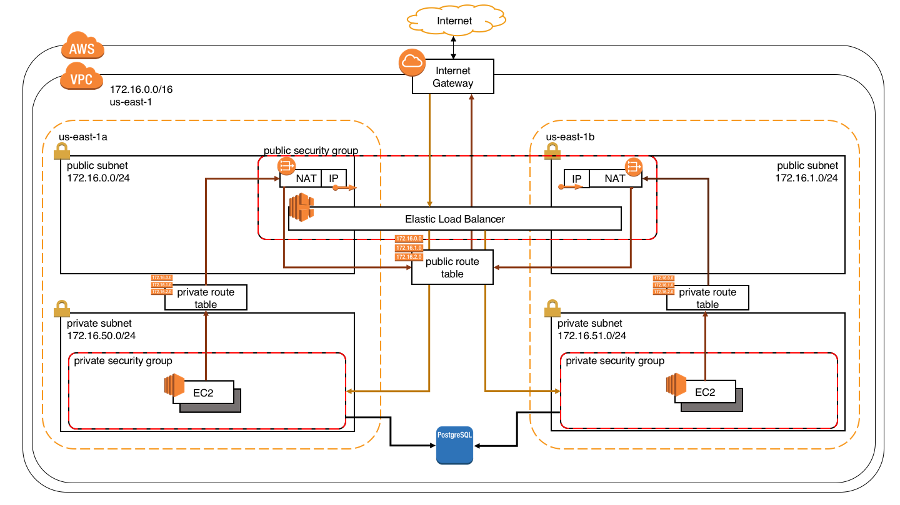

== Create a complete AWS cluster with Terraform

A AWS cluster with all necessary resources is created automatically by Terraform. This cluster consist of the following
resources:

* Amazon VPC +
    The Amazon Virtual Private Cloud (VPC) contains all resources we are about to create. The VPC lays in the region
    `us-east` and creates an network with the CIDR `172.16.0.0/16` (see `terraform.tfvars`).
* Internet Gateway +
    The Internet Gateway is a component inside of the VPC that allows communication between instances in the VPC and the
    Internet.
* Subnet +
    Our VPC contains four subnets. Two public and two private subnets. The public subnets have the CIDR `172.16.0.0/24`
    and `172.16.1.0/24`. The private subnets `172.16.50.0/24` and `172.16.51.0/24` (see `terraform.tfvars`).
* NAT Gateway +
    Each public subnet contains a NAT gateway which is associated with a Elastic IP address and could communicate via
    the Internet Gateway with the Internet. Instances in a private subnet cloud have Internet access via such a NAT
    Gateway.
* Public Route Table +
    Public subnet instances of both public subnets should be able to communicate with other resources in the VPC and to
    communicate with the Internet. The necessary routing entries an configured in this table.
* Private Route Tables +
    Private subnet instances should be able to communicate with other resources in the VPC and to communicate with the
    Internet through the NAT Gateway. Each private subnet has it's own private rout table.
* Security Groups +
    Configures with inbound and outbound traffic is allowed to the instances. Here we configure the ports which are
    opened for instances. There is a public security group for instances in the public subnet and a private security
    group for private subnet instances.
* Amazon EC2 +
    The Amazon Elastic Compute Cloud (Amazon EC2) are the serves were applications could be installed. We create EC2
    instances in both private subnets.
* Elastic Load Balancing +
    A load balancer lays in the public security group and is responsible to istributes incoming application traffic
    across all EC2 instances in both private subnets.
* Amazon RDS
    Finally a Amazon Relational Database Service (Amazon RDS) in form of a PostgreSQL is created. This PostgreSQL lays
    in a subnet group and is accessible by the EC2 instances from both private subnets.

=== Terraform commands

To build the whole AWS infrastructure automatically with Terraform first Terraform needs to be downloaded an installed.
https://www.terraform.io/downloads.html

Before executing any of the Terraform commands the environment variables `AWS_ACCESS_KEY_ID` and `AWS_SECRET_ACCESS_KEY`
needs to be set with the appropriate AWS credentials.

terraform init ::
    The terraform init command is used to initialize a working directory containing Terraform configuration files.

terraform get ::
    The terraform get command is used to download and update modules mentioned in the root module.

terraform plan -input=false ::
    This command is a convenient way to check whether the execution plan for a set of changes matches your expectations
    without making any changes to real resources or to the state

terraform apply -input=false -auto-approve ::
    The terraform apply command is used to apply the changes required to reach the desired state of the configuration, or
    the pre-determined set of actions generated by a terraform plan execution plan.

terraform destroy ::
    The terraform destroy command is used to destroy the Terraform-managed infrastructure.

=== Licensing
The software of this repository is licensed under the GNU General Public License v2.
See [LICENSE](https://www.gnu.org/licenses/gpl-2.0.html) for the full license text.